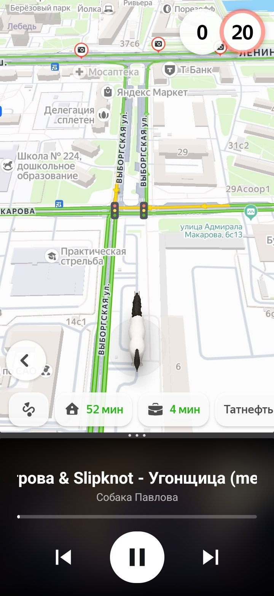

# PulseDeck

Compact Android media controller for split-screen use with maps.

PulseDeck is designed for a phone layout where a navigation app occupies most of the screen and PulseDeck runs in the other split-screen pane. It controls the currently active Android media session without drawing overlays over other apps.



## Features

- Previous / play-pause / next controls.
- Current track title and artist.
- Album art used as a blurred background when provided by the player.
- Real playback progress from `MediaSession` metadata and state.
- Long track titles scroll horizontally.
- Automatically reconnects when the active player changes.
- Large, high-contrast controls for use while driving.
- Supports players that expose standard Android media controls, including YouTube Music and Yandex Music for playback controls.

## Important permission

PulseDeck uses Android's **Notification access / media sessions** permission to discover and control another app's active media session. Without this permission, PulseDeck cannot see the current track or send playback commands.

PulseDeck does not include a music catalogue, does not stream audio, and does not use an overlay window.

## Build locally

Requirements:

- JDK 17
- Android SDK Platform 35
- Android Build Tools 35

```bash
./gradlew assembleDebug
```

The APK is written to:

```text
app/build/outputs/apk/debug/app-debug.apk
```

## Install on a device

```bash
adb install -r app/build/outputs/apk/debug/app-debug.apk
```

Then open PulseDeck, enable its notification access in Android Settings, start a supported music app, and put PulseDeck in split screen with your navigation app.

## GitHub Actions

The `android-ci.yml` workflow runs on pushes and pull requests. It checks the project and publishes a debug APK as a workflow artifact.

The `release.yml` workflow builds a signed Android App Bundle when a `v*` tag is pushed. Configure these repository secrets before creating a release:

- `ANDROID_KEYSTORE_BASE64`
- `ANDROID_KEYSTORE_PASSWORD`
- `ANDROID_KEY_ALIAS`
- `ANDROID_KEY_PASSWORD`

Create a release tag:

```bash
git tag v0.1.0
git push origin v0.1.0
```

The signed `.aab` will be available as a GitHub Actions artifact. Upload it to Google Play Console after completing the store listing and Play App Signing setup.

## License

MIT. See [LICENSE](LICENSE).
